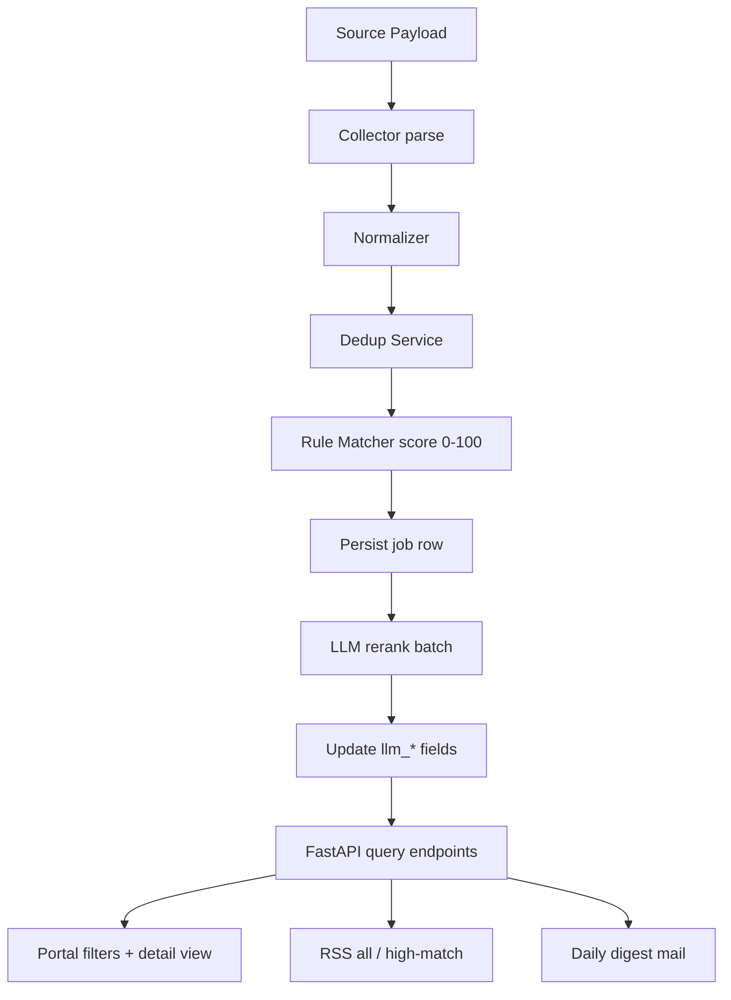
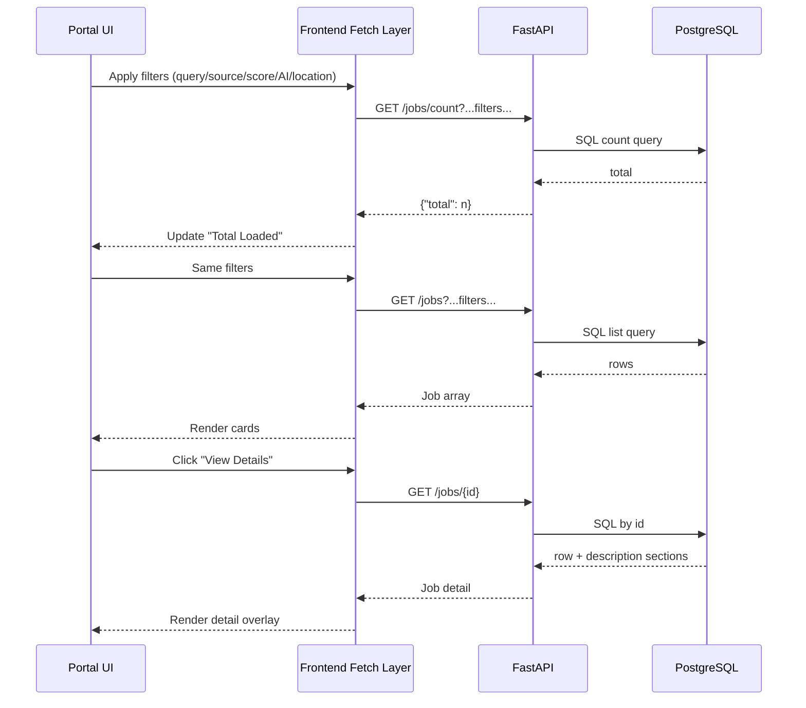
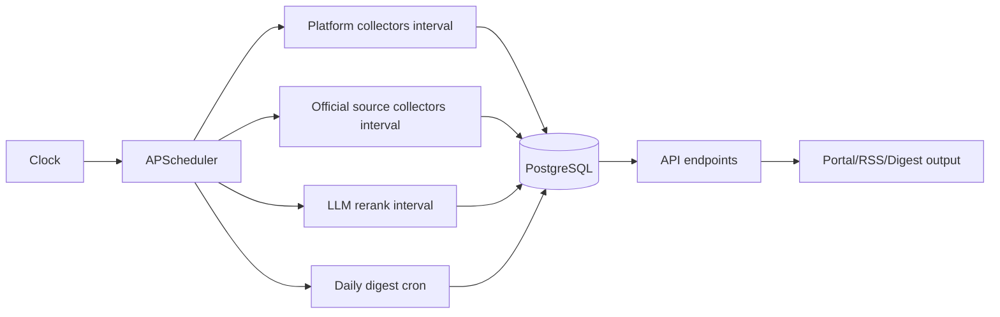
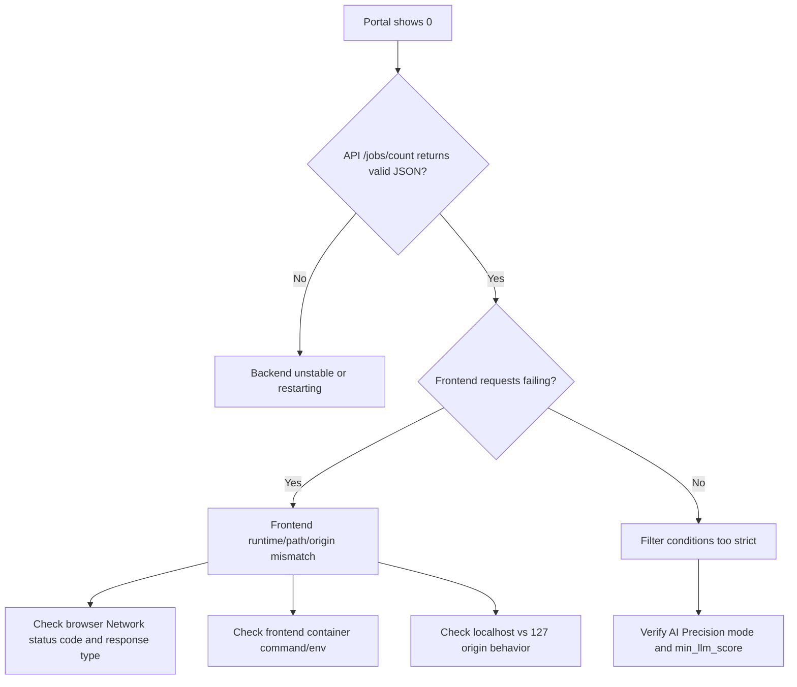

# JobsRSS V2 Architecture Diagram (for Archive)

This file provides diagrams for release review and long-term documentation.

---

## 1) System Context (Runtime Services)

```mermaid
flowchart LR
    U[User Browser]

    subgraph FE[Frontend Service]
      N[Next.js Portal :3000]
      P1["/api/backend/* proxy route (optional)"]
      P2["Direct API fetch fallback\nhttp://{host}:8000"]
    end

    subgraph BE[Backend Service]
      A[FastAPI API :8000]
      R1[/jobs]
      R2[/jobs/count]
      R3[/jobs/summary/last-24h]
      R4[/jobs/{id}]
      R5[/sources/official]
      R6[/rss/all.xml]
      R7[/rss/high-match.xml]
    end

    subgraph WK[Worker Service]
      S[APScheduler]
      C1[LinkedIn / Liepin / 51job collectors]
      C2[Official source collectors]
      LLM[LLM rerank job]
      D[Daily digest job]
    end

    DB[(PostgreSQL)]

    U --> N
    N --> P1
    N --> P2
    P1 --> A
    P2 --> A

    A --> R1
    A --> R2
    A --> R3
    A --> R4
    A --> R5
    A --> R6
    A --> R7

    R1 --> DB
    R2 --> DB
    R3 --> DB
    R4 --> DB
    R5 --> DB
    R6 --> DB
    R7 --> DB

    S --> C1
    S --> C2
    S --> LLM
    S --> D

    C1 --> DB
    C2 --> DB
    LLM --> DB
    D --> DB
```

---

## 2) Data Pipeline (Ingestion + Matching + Publication)



---

## 3) Frontend Query Flow (Filter-Driven)



---

## 4) Scheduler and Update Cadence



---

## 5) Known Failure Modes (Observed During V2 Validation)



---

## 6) Release Test Checkpoints (Recommended)

```mermaid
flowchart TD
    S1[Healthz OK] --> S2[/jobs/count baseline > 0]
    S2 --> S3[Portal Total Loaded equals count API]
    S3 --> S4[AI Precision On/Off filter verification]
    S4 --> S5[Details overlay and description sections]
    S5 --> S6[RSS all/high-match readable UTF-8]
    S6 --> S7[Worker collector_run and llm_rerank_run observed]
    S7 --> GO[Go/No-Go decision]
```

